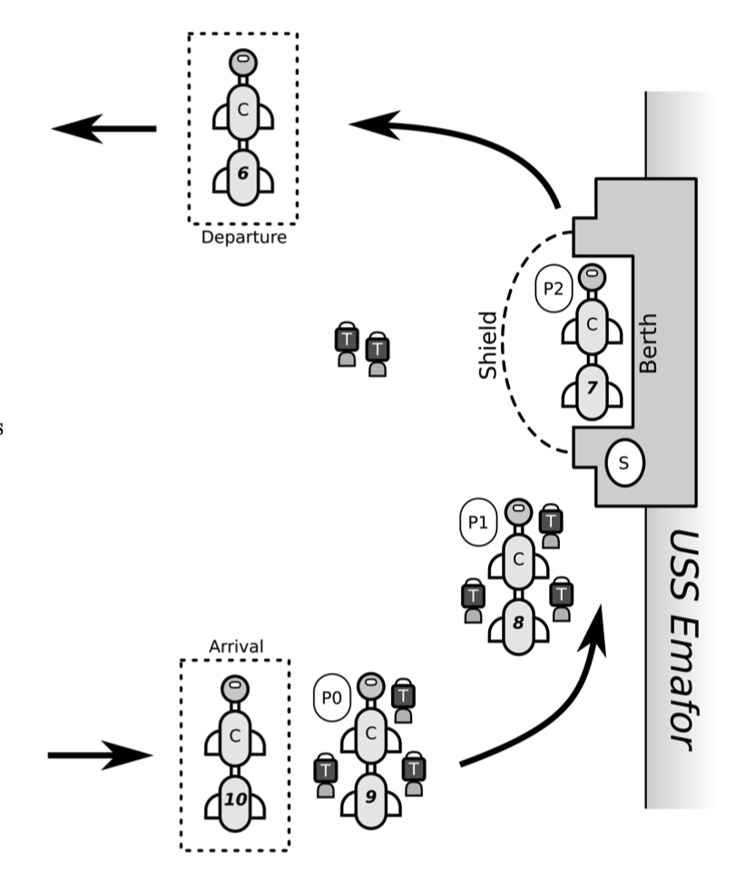
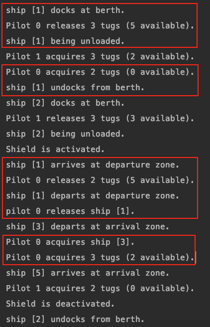

# Space Station Docking System Simulator

## Project Description
In this project, we are going to implement a concurrent system to explore the behaviour of a complex system. 

## Background and context
There are three main parts in the system, including arrival wait zone, USS Emafor’s berth and departure wait zone.  

### Steps:
1. Cargo ships arrive at an arrival wait zone, approximately ten kilometres from the Emafor.
2. A pilot is transported to the cargo ship to safely handle operations, approaching, docking, unloading of cargo, undocking and departuring.
3. The berth can only hold one cargo ship at a time. Before they commence docking a cargo ship, a pilot must have engaged three tugs.
4. These tugs are used during the docking process, and released once unloading of cargo commences.
5. Shield are periodically activated to protect the space station from space debris. While the shield is activated, no cargo ships can start docking or undocking from the berth until after the shield is deactivated. Ships that have already started the docking or undocking process when the shield is activated can safely complete their action. 
6. Before commencing undocking, a pilot must have engaged two tugs.
7. After undocking, the cargo ship returns to a departure wait zone, and the tugs used for undocking are released.
8. The pilot is then transported off the cargo ship, and then acquire a new cargo ship (from the arrival wait zone).

## System diagram

    

 

## System design and components
- Producer: Generates new cargo ships arriving at the USS Emafor wait zone, subject to room being available. The times between arrivals will be varied.
- Consumer: Removes cargo ships who have finished unloading, once they have undocked and returned to the wait zone. Departing ships leave the wait zone immediately.
- Pilot: Acquires a newly arrived cargo ship, acquires the required number of tugs to dock the ship. After the ship is unloaded, acquires tugs for undocking.
- Operator: Periodically activates the shield to protect the space station from space debris.
- Ship.java: Cargo ships are used for transportation.
- Main.java: The main driver of the simulation.

## Metrics
The simulator produced a trace of events below.  

    

